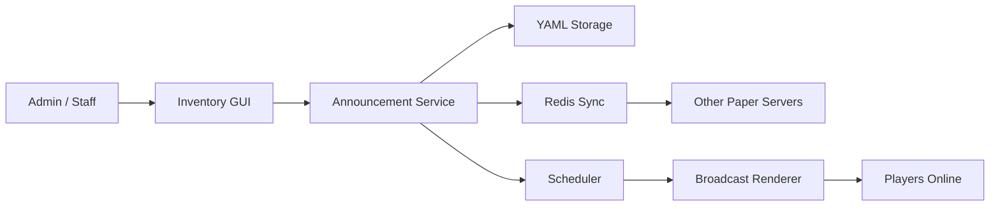

<div align="center">

# AnnouncementGUI

**Modern inventory-based announcement management for Paper networks**

Create, style, schedule, and sync announcement panels across single-server or multi-server Minecraft environments.

<p>
  
  
  
  
</p>

</div>

---

## Overview

AnnouncementGUI is a Paper plugin that replaces flat chat broadcasts with structured announcement panels managed through an in-game GUI.

It is designed for:

- server owners who want GUI-based announcement management
- networks that need `LOCAL`, `SERVER`, `GROUP`, or `GLOBAL` targeting
- communities that want cleaner presentation than classic `prefix + message` chat output
- multi-server setups that need cross-server sync through Redis

## Why AnnouncementGUI

| Capability | Included |
| --- | --- |
| In-game CRUD GUI | Yes |
| Scheduled broadcasting | Yes |
| Styled panel output | Yes |
| Title + description + body layout | Yes |
| Mixed legacy colors | Yes |
| Hex color support | Yes |
| Multi-server sync via Redis | Yes |
| Shared SQL storage | Not yet |

## Highlights

- **Panel-style output** with top border, centered title, centered description, and body section
- **Targeted broadcasting** for single server, selected servers, server groups, or entire network
- **GUI management flow** for create, edit, and delete actions
- **Structured announcement schema** with internal name, title, description, body, interval, targets, and enabled state
- **Cross-server event sync** through Redis Pub/Sub
- **Customizable format rules** through config

## Visual Style

AnnouncementGUI is built around a cleaner broadcast layout:

```text
------------------------------------------------
                Welcome! Adarshh
               in example network
------------------------------------------------
Website: www.example.com
Discord: discord.example.com
Store: store.example.com
------------------------------------------------
```

Alternative spacing style:

```text
------------------------------------------------
                Announcement
        Default network announcement

To put text in center use <center>YOURTEXT</center>
------------------------------------------------
```

## Architecture



## Core Features

### GUI management

- Main menu for announcement management
- Create, edit, and delete announcement flows
- Chat-driven field input prompts
- Toggle active state without restarting the server

### Broadcast formatting

- Top border
- Centered title
- Centered description lines
- Divider or blank spacing before the message body
- Left-aligned body by default
- Optional `<center>...</center>` per body line

### Network-aware targeting

- `LOCAL`
- `SERVER`
- `SERVERS`
- `GROUP`
- `GLOBAL`

### Cross-server sync

- Create sync
- Update sync
- Delete sync
- Force-broadcast sync

## Configuration Model

Main config:

```text
plugins/AnnouncementGUI/config.yml
```

### Example config

```yml
server:
  id: "lobby-1"
  groups:
    - "lobby"
    - "network"

storage:
  file: "announcements.yml"

sync:
  enabled: true
  type: "REDIS"
  redis:
    uri: "redis://127.0.0.1:6379/0"
    channel: "announcementgui:sync"

scheduler:
  check-interval-ticks: 20

formats:
  panel:
    top-border: "&6&m------------------------------------------------"
    body-divider: "&6&m------------------------------------------------"
    bottom-border: "&6&m------------------------------------------------"
    body-separator-mode: "DIVIDER"
```

### `server.id`

`server.id` is the unique identifier for **one Paper server instance**.

It is **not** a Minecraft world name.

Examples:

- `lobby-1`
- `survival-1`
- `survival-2`
- `minigame-1`

### `server.groups`

`groups` are logical **server categories**.

They are **not** world names.

Examples:

- `lobby`
- `survival`
- `minigame`
- `economy`

## Multi-Server Setup

To enable cross-server sync:

1. Give every server a unique `server.id`
2. Point every server to the same Redis instance
3. Use the same Redis `channel`
4. Set `sync.enabled: true`

### Example

**Lobby server**

```yml
server:
  id: "lobby-1"
  groups:
    - "lobby"
```

**Survival server**

```yml
server:
  id: "survival-1"
  groups:
    - "survival"
```

**Shared Redis config**

```yml
sync:
  enabled: true
  type: "REDIS"
  redis:
    uri: "redis://:yourpassword@redis.example.com:6379/0"
    channel: "announcementgui:sync"
```

## Color and Formatting Support

Supported color formats:

- legacy color codes like `&a`, `&b`, `&6`, `&c`
- style codes like `&l`, `&m`, `&n`, `&o`
- hex color codes like `&#55FFFF`

Example:

```text
Title: &bWelcome! &6Adarshh
Description: &cin example network
Body: Website: &#55FFFFwww.example.com|Discord: &ediscord.example.com|Store: &astore.example.com
```

Body line centering:

```text
<center>&bThis line will be centered</center>
```

## Commands

| Command | Description |
| --- | --- |
| `/announcementgui` | Open the main GUI |
| `/agui` | Shortcut for the main GUI |
| `/announcement open` | Open the main GUI |
| `/announcement reload` | Reload config and plugin state |
| `/announcement list` | Show existing announcements |
| `/announcement broadcast <id>` | Force broadcast an announcement |

## Permissions

| Permission | Description |
| --- | --- |
| `announcementgui.open` | Open the GUI |
| `announcementgui.create` | Create announcements |
| `announcementgui.edit` | Edit announcements |
| `announcementgui.delete` | Delete announcements |
| `announcementgui.reload` | Reload the plugin |
| `announcementgui.broadcast` | Force broadcast announcements |
| `announcementgui.admin` | Full access |

## Storage and Sync

Current implementation:

- **Primary storage:** local YAML file
- **Cross-server sync:** Redis Pub/Sub events

What this means:

- `announcements.yml` is still the main source of data on each server
- Redis distributes change events, not the full authoritative database layer
- a server that is offline during a sync event may become stale

For larger production networks, the recommended next step is:

- **MySQL / MariaDB as shared storage**

## Build

Build with Maven:

```bash
mvn clean package
```

Expected output:

```text
target/announcementgui-1.0.jar
```

## Testing Checklist

- Plugin loads without startup errors
- `/agui` opens the main menu
- Create flow works
- Edit flow updates saved announcements
- Delete flow removes announcements correctly
- Announcements persist after restart
- Scheduler broadcasts at the configured interval
- `SERVER` targeting works
- `GROUP` targeting works
- Redis sync propagates changes across servers

## Limitations

- Shared SQL storage is not implemented yet
- Redis sync is event-based, not database-based
- Offline servers can miss sync updates
- Prompt input currently relies on Bukkit conversation flow

## Roadmap

- Shared SQL storage for stronger consistency
- Safer resync for servers that were offline
- Better GUI target selector
- Richer preview and formatting presets
- Additional admin diagnostics

## License

Licensed under the Apache License 2.0. See [LICENSE](LICENSE).
